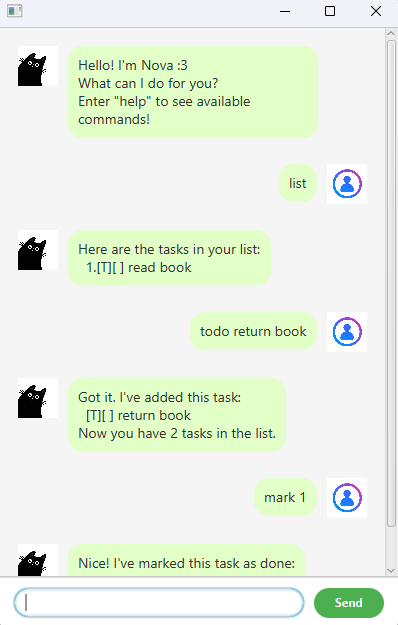

# Nova User Guide

A simple task management chatbot that helps you track to dos, deadlines, and events via natural text commands.

- [Quick start](#quick-start)
- [Features](#features)
    - [Viewing help: ```help```](#viewing-help-help)
    - [Adding To Do task: ```todo```](#adding-to-do-task-todo)
    - [Adding Deadline task: ```deadline```](#adding-deadline-task-deadline)
    - [Adding Event task: ```event```](#adding-event-task-event)
    - [Listing all tasks: ```list```](#listing-all-tasks-list)
    - [Viewing schedule: ```schedule```](#viewing-schedule-schedule)
    - [Marking a task as done: ```mark```](#marking-a-task-as-done-mark)
    - [Unmarking a task: ```unmark```](#unmarking-a-task-unmark)
    - [Deleting a task: ```delete```](#deleting-a-task-delete)
    - [Exiting the program: ```bye```](#exiting-the-program-bye)
- [FAQ](#faq)
- [Command summary](#command-summary)

---

## Quick Start
1. Ensure you have Java ```17``` or above installed in your Computer.
Mac users: Ensure you have the precise JDK version prescribed [here](https://se-education.org/guides/tutorials/javaInstallationMac.html).

2. Download the latest ```.jar``` file from here.

3. Copy the file to the folder you want to use as the home folder for your AddressBook.

4. Open a command terminal, ```cd``` into the folder you put the jar file in, and use the ```java -jar addressbook.jar``` command to run the application.  A GUI similar to the below should appear in a few seconds. Note how the app contains some sample data. 

5. Type the command in the command box and press Enter or the Send Button to execute it. e.g. typing help and pressing Enter will show the available commands.
   Some example commands you can try: 
   - ```list``` : Lists all tasks
   - ```deadline return book /by Dec 31 2025``` : Adds a task with a deadline to Nova
   - ```mark 1```: Marks tasks 1 as complete
   - ```delete 1``` Deletes task 1
   - ```bye``` Exits the app
6. Refer to the [Features](#features) below for details of each command.
---
## Features

### Viewing help: ```help```
Shows a message listing the available commands.

Format: ```help```
### Adding To Do task: ```todo```
Adds a simple task without any date or time attached.

Format: ```todo <description>```

Examples:
- ```todo borrow book```
- ```todo return book```

### Adding Deadline task: ```deadline```
Adds a task that must be completed by a specific date.

Format: ```deadline <description> /by <date>```

Examples: 
- ```deadline return book /by Dec 31 2025```
- ```deadline return book /by 31/12/2025```

### Adding Event task: ```event```
Adds a task that occurs over a specific period of time.

Format: ```event <description> /from <date> /to <date>```

Examples:
- ```event project meeting /from Dec 30 2025 /to Dec 31 2025```
- ```event project meeting /from 30/12/2025 /to 31/12/2025```

### Listing all tasks: ```list```
Displays all current tasks with their statuses and numbering.

Format: ```list```

### Viewing schedule: ```schedule```
Shows all tasks scheduled on the given date.

Format: ```schedule <date>```

Examples:
- ```schedule Dec 31 2025```
- ```schedule 31/12/2025```

### Marking a task as done: ```mark```
Marks the specified task as completed.

Format: ```mark <task number>```

### Unmarking a task: ```unmark```
Marks the specified task as not completed.

Format: ```unmark <task number>```

### Deleting a task: ```delete```
Removes the specified task from the list permanently.
- Deletes the person at the specified INDEX.
- The index refers to the index number shown in the displayed person list.
- The index must be a positive integer 1, 2, 3. ...

Format: ```delete <task number>```

### Exiting the program: ```bye```
Closes the application.

Format: ```bye```

### Saving the data
Nova's data is saved in the hard disk automatically after any command that changes the data. There is no need to save manually.

### Editing the data file
Nova's data is saved automatically as a .txt file [JAR file location]/data/tasks.txt. Advanced users are welcome to update data directly by editing that data file.

## FAQ
Q: How do I transfer my data to another Computer?

A: Install the app in the other computer and overwrite the empty data file it creates with the file that contains the data of your previous Nova home folder.

## Command summary

| Action       | Format, Examples                                                                                                                                                                  |
|--------------|-----------------------------------------------------------------------------------------------------------------------------------------------------------------------------------|
| Help         | `help`                                                                                                                                                                            |
| Add To Do    | `todo <description>`<br>e.g., `todo borrow book`<br>e.g., `todo return book`                                                                                                      |
| Add Deadline | `deadline <description> /by <date>`<br>e.g., `deadline return book /by Dec 31 2025`<br>e.g., `deadline return book /by 31/12/2025`                                                |
| Add Event    | `event <description> /from <date> /to <date>`<br>e.g., `event project meeting /from Dec 30 2025 /to Dec 31 2025`<br>e.g., `event project meeting /from 30/12/2025 /to 31/12/2025` |
| List         | `list`                                                                                                                                                                            |
| Schedule     | `schedule <date>`<br>e.g., `schedule Dec 31 2025`<br>e.g., `schedule 31/12/2025`                                                                                                  |
| Mark as done | `mark <task number>`<br>e.g., `mark 2`                                                                                                                                            |
| Unmark       | `unmark <task number>`<br>e.g., `unmark 2`                                                                                                                                        |
| Delete       | `delete <task number>`<br>e.g., `delete 3`                                                                                                                                        |
| Exit         | `bye`                                                                                                                                                                             |


